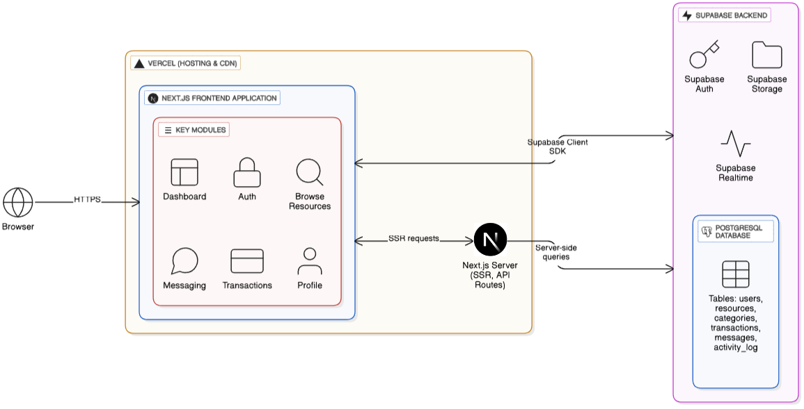

# 🎓 Campus Exchange — Student Resource Sharing Platform

## Overview
Campus Exchange is a full‑stack web application that enables students to list, lend, sell, and borrow academic resources (textbooks, lab kits, stationery, notes) within a campus network. The platform delivers secure authentication, transaction workflows, and realtime messaging backed by a normalized PostgreSQL schema and cloud storage. It is built for production deployment on Vercel with Supabase as the backend platform.

The app connects students as owners and requesters to streamline peer‑to‑peer exchanges with transparency and auditability.

***

## Key Highlights
- Secure account system with Supabase Auth and protected dashboard
- Resource listings with images, categories, pricing/type, and availability
- Transaction workflow with owner actions (Accept/Reject) and automatic inventory state updates
- Realtime, transaction‑scoped messaging using Supabase Realtime
- Activity logging (activity_log) to capture key user actions
- Responsive dashboard UI with collapsible sidebar and consistent layouts

## Live
- Application: https://campus-exchange-zghc.vercel.app/

***

## Project Development Steps
1. Requirements and UX flows for listing, messaging, and transactions
2. Database schema design (6 tables) and storage buckets
3. Authentication integration and route protection
4. Resource CRUD with image uploads and category taxonomy
5. Transaction lifecycle with availability sync and activity logs
6. Realtime messaging UI with scroll‑synced panes
7. Vercel deployment with environment‑driven configuration

***

## Architecture
- Frontend: Next.js (App Router), React, Tailwind CSS, shadcn/ui
- Server: Next.js server components and route handlers
- Backend: Supabase (Auth, PostgreSQL, Storage, Realtime)
- Infra: Vercel hosting and CDN

High‑level flow:
1. Users sign in via Supabase Auth
2. Owners create resources with images and availability
3. Requesters initiate transactions; owners Accept/Reject
4. On Accept, the linked resource availability_status → “unavailable”
5. Parties chat in realtime within the transaction thread

Architecture diagram :

***

## Data Model
Tables (Supabase PostgreSQL):
- users
- resources
- categories
- transactions
- messages

***

## Core Modules
- Authentication: email/password with persistent sessions
- Resources: create/edit/delete, upload images to Storage, assign categories, manage availability
- Transactions: requester → owner flow, Accept/Reject, automatic availability updates
- Messages: realtime chat per transaction with scrollable conversation and fixed input
- Dashboard: sidebar navigation, overview metrics, recent activity

***
## Acknowledgments
Built using Next.js and Supabase. Thanks to the Supabase and shadcn communities for excellent tooling and documentation.
